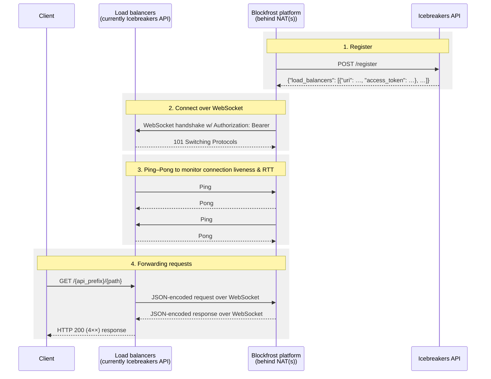

# Blockfrost Icebreakers

Icebreakers プログラムは、Cardano ノードオペレーターのネットワークがノードリソースを共有することで参加する、インセンティブ付きのテストイニシアチブです。
これらのオペレーターは Cardano ブロックチェーンに格納されたデータへのアクセスを提供し、既存のコミュニティインフラストラクチャを活用することで Blockfrost の分散化を目指します。

参加する各 Cardano ノードオペレーターは Blockfrost プラットフォームソフトウェアをインストールし、Blockfrost バックエンドのフリートに参加してリソースを提供します。
その対価として、提供したデータサービスから収益を得ることができます。

Blockfrost の顧客は、Icebreakers を通じてシームレスにブロックチェーンデータへアクセスでき、その提供元を意識することはほとんどありません。

## 構成図

以下の図は、Blockfrost Icebreakers ネットワークの初期構成を概略的に表しています。
詳細は下記の [技術的詳細](#technical-details) セクションをご覧ください。


## Icebreaker になりたい方

まだ若干名の枠が残っています。
[Discord](https://discord.com/invite/inputoutput) の `#ask-blockfrost` チャンネルでお気軽にお声がけください。

## 技術的詳細

以下のシーケンス図は、通信の全体像を示しています。



### 1. 登録

[非ソリタリーモード](/options) で `blockfrost-icebreakers-api` に登録すると、`blockfrost-platform` は接続先のロードバランサーのリストを含む追加フィールドを成功レスポンスで受け取ります。

```json
{
  "route": "b0be51e5-e5fe-4e42-98a9-2246173bea19",
  "load_balancers": [
    {
      "uri": "wss://icebreakers-api.blockfrost.io/ws",
      "access_token": "QNo3SYA0iPY+LfEhb2Gi5NaUOXqLw4b7ZQyg9DL4hFs="
    }
  ]
}
```

### 2. WebSocket 経由で接続

`blockfrost-platform` は WebSocket エンドポイントに接続し、`Authorization: Bearer <access_token>` を設定します。

現在、この新しい WebSocket エンドポイントは初期テスト中のため、同じ Icebreakers API によって提供されています。将来的には可用性を高めるために複数のロードバランサーが用意されます。

### 3. 接続生存性とラウンドトリップ時間を監視する Ping–Pong

1. 双方が `Ping` と `Pong` メッセージを継続的に交換することで、無音のパケットドロップが発生した場合でも相手方のオフライン状態を素早く検知でき、高度な計算オーバーヘッドなしにネットワーク純粋なラウンドトリップ時間を計測できます。

2. ロードバランサーは `GET /stats` エンドポイントを公開しており、現在接続中のすべての Icebreakers を確認できます。

   ```
   ❯ curl -fsSL https://icebreakers-api.blockfrost.io/stats | jq .
   ```

   ```json
   {
     "IcebreakerX": {
       "api_prefix": "b0be51e5-e5fe-4e42-98a9-2246173bea19",
       "network_rtt_seconds": 0.000387182,
       "connected_since": "2025-03-28T19:09:46.399124184Z",
       "requests_sent": 0,
       "responses_received": 0,
       "requests_in_progress": 0
     }
   }
   ```

### 4. リクエストの転送

1. 最も重要なロードバランサーのエンドポイントは `GET /{api_prefix}/{path}` と `POST /{api_prefix}/{path}` です。
   - 上記の例で `curl -fsSL https://icebreakers-api.blockfrost.io/b0be51e5-e5fe-4e42-98a9-2246173bea19/` を実行すると、このリクエストは JSON メッセージに変換され、`api_prefix` で識別される IcebreakerX との WebSocket 接続を経由して送信されます。

     ```json
     {
       "id": "04810b96-87cd-4af0-8c1b-7b5e00806769",
       "method": "GET",
       "path": "/",
       "header": [
         {
           "name": "host",
           "value": "0.0.0.0:3001"
         },
         {
           "name": "user-agent",
           "value": "curl/8.11.1"
         },
         {
           "name": "accept",
           "value": "*/*"
         }
       ],
       "body_base64": ""
     }
     ```

   - すると、その `blockfrost-platform` はリクエストをローカル HTTP サーバーに対して解決します。これは安価かつメモリ上で完結し、自己への新たな TCP 接続を開く必要はありません。
   - レスポンスは JSON レスポンスメッセージに再度エンコードされ、WebSocket 経由でロードバランサーに送り返されます。

     ```json
     {
       "id": "04810b96-87cd-4af0-8c1b-7b5e00806769",
       "code": 200,
       "header": [
         {
           "name": "content-type",
           "value": "application/json"
         },
         {
           "name": "content-length",
           "value": "241"
         }
       ],
       "body_base64": "eyJuYW1lIjoiYmxvY2tmcm9zdC1wbGF0Zm9ybSIsInZlcnNpb24iOiIwLjAuMiIsInJldmlzaW9uIjoiZGlydHkiLCJoZWFsdGh5Ijp0cnVlLCJub2RlX2luZm8iOnsiYmxvY2siOiIyNjkzZTk1M2M4NmU0NzZlNGZhMmFhYWY2MDZjZWRjOThhZmU1ZjEwZTFhZDViYTk3NmNmZDkxNzI4NGI4MGJiIiwiZXBvY2giOjg4NSwiZXJhIjo2LCJzbG90Ijo3NjU0MjI5Niwic3luY19wcm9ncmVzcyI6OTkuOTV9LCJlcnJvcnMiOltdfQ=="
     }
     ```

   - これがロードバランサー側で HTTP レスポンスに変換され、エンドユーザーへ送信されます。

   #### 例

   ```
   ❯ curl -fsSL https://icebreakers-api.blockfrost.io/b0be51e5-e5fe-4e42-98a9-2246173bea19/ | jq .
   ```

   ```json
   {
     "name": "blockfrost-platform",
     "version": "1.0.0",
     "revision": "1134f1a3027e3cbaf81f5e5595aadd1bcfefdae7",
     "healthy": true,
     "node_info": {
       "block": "6d87f87a0642fd4a59bb8af89400e8c7a777e290d2c2e02ceb93059ac7b4aaba",
       "epoch": 885,
       "era": 6,
       "slot": 76533840,
       "sync_progress": 100.0
     },
     "data_node": {
       "url": "http://localhost:3010",
       "version": "1.0.0",
       "revision": "abc123"
     },
     "errors": []
   }
   ```

2. `blockfrost-platform` API はこれまでどおりポート 3000 で動作します。WebSocket テスト期間の終了後は、外部公開や UUID 形式の `api_prefix` を持つ必要はなくなります。

### 運用上の詳細

- **リクエストタイムアウト**: WebSocket 経由で転送される各リクエストには 60 秒のタイムアウトがあります。
- **最大ボディサイズ**: リクエストボディは 1 MB に制限されます。
- **再登録**: ロードバランサー接続が切断された場合、プラットフォームは自動的に再登録します。接続が成功した場合は 1 秒後、エラーの場合は 10 秒後に再登録します。
- **接続動作**: 単一のロードバランサー接続が切れると、すべての接続が中断され、完全な再登録サイクルが開始されます。
- **ロードバランサーなし**: 登録レスポンスにロードバランサーが含まれない場合、プラットフォームは一度だけ登録を行い、再試行はしません。
